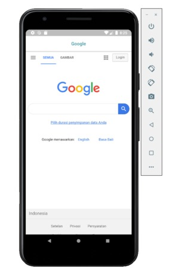
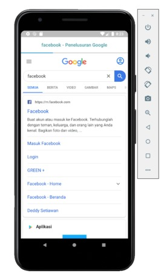
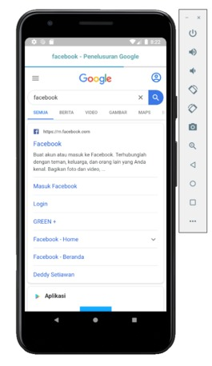

# Simple Application Android Webview With Progress Bar

Simple Application Webview with Progress Bar build with Java & Android Studio.

### Prerequisites

You must have Android Studio to run this Application

### Installing

[Download](https://github.com/bonamoogy/webview-android-progress-bar/archive/master.zip) or Clone this repository. Extract Zip & Open into your Android Studio.

Change the Home Url

```
private String URL = "<your home URL>";
```

### Snapshots

   
